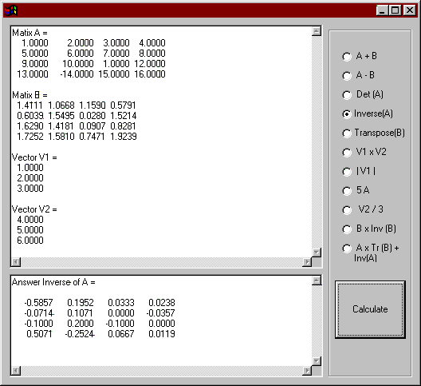



## Matrix Operations Library

### Description

Matrix Operations Library

About a year ago, I was working on a project. The project required many matrix operations, that time I really wished that I would find a class or a library with ready functions for matrix manipulations (like addition, inverse, multiplication, etc…) to use in Visual Basic. Unfortunately I could not find such a class, so I decided to write my own class, I called it "cMathLib" . This class gives the user the flexibility to work with matrices and do operations on them. The dimensions of the matrices are neither pre-specified nor limited. The code is highly optimized for fast operation. The code attached contains the class file called with a demonstration on how to use it.

Opperations included in the class are :

Add, Subtract, Determinant, Inverse, Transpose, Multiply, atan2, arc cos, arc sin, PI, Print, MultiplyVectors,Magnitude of a Vector, scalar multiply, and scalar divide.

I really hope this class would be of any help to any of you who needs to work with matrix operations.
 
### More Info
 

             |
---                |---
**Submitted On**   |2003-01-16 15:31:04
**By**             |[Anas S\. A\.](https://github.com/Planet-Source-Code/PSCIndex/blob/master/ByAuthor/anas-s-a.md)
**Level**          |Advanced
**User Rating**    |5.0 (243 globes from 49 users)
**Compatibility**  |VB 4\.0 \(32\-bit\), VB 5\.0, VB 6\.0
**Category**       |[Math/ Dates](https://github.com/Planet-Source-Code/PSCIndex/blob/master/ByCategory/math-dates__1-37.md)
**World**          |[Visual Basic](https://github.com/Planet-Source-Code/PSCIndex/blob/master/ByWorld/visual-basic.md)
**Archive File**   |[Matrix\_Ope1530071162003\.zip](https://github.com/Planet-Source-Code/anas-s-a-matrix-operations-library__1-42477/archive/master.zip)

